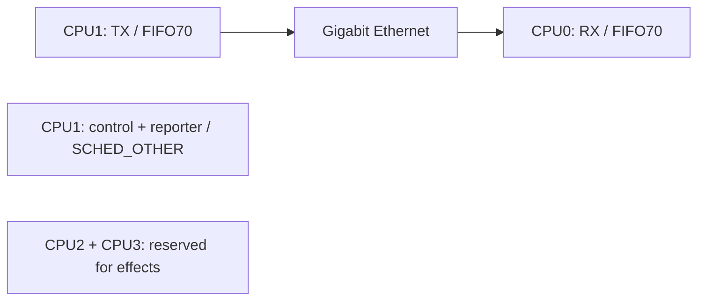

# Pi5-AoIP

Версия 2.2: [8×8 / 192 кГц / PCM32, минимальная задержка и энергосбережение](docs/LOW-LATENCY.md).

[English](README.md) | **Русский**

Платформенная библиотека и служба AoIP для **Raspberry Pi 5 Model B** с
**PREEMPT_RT**. Выбирает проводной интерфейс, назначает CPU сетевым потокам
и запускает общий runtime из AoIP-lib. Устанавливается пакетом `.deb`.

**[Начало работы](docs/BUILD.md)** · **[RT-образ](docs/RT-IMAGE.md)** · **[Архитектура](docs/ARCHITECTURE.md)** · **[Проверки на Pi5](docs/VALIDATION.md)** · **[Лицензия](docs/LICENSE-RU.md)**

## Назначение

| Компонент | Что делает |
|---|---|
| `Pi5AoIP::platform` | Проверка Pi 5/RT, Ethernet IPv4, привязка потоков |
| `aoip_peer_rpi5` | Запуск общего синтетического PCM peer с политикой платы |
| `pi-aoip.service` | Отдельный пользователь, лимиты RT, состояние и автозапуск |
| `piaoip-configure` | Настройка интерфейса и IPv4 компьютера |

## Распределение CPU



Сеть использует только **CPU0/CPU1**. CPU2/CPU3 оставлены для эффектов.
Библиотека не перенастраивает IRQ, Wi-Fi, Bluetooth, USB, GPIO или governor.

## Быстрый старт

Нужны Pi 5, Debian 13 ARM64, уже установленное RT-ядро и проводной Gigabit Ethernet.
Проверено на Pi5 Model B Rev 1.1 / 4 ГБ с Raspberry Pi OS Lite 64-bit и
официальным ядром `6.18.50+rpt-rpi-v8-rt`. BCM2712/RP1 и периферия поддерживаются.

```sh
git clone --recurse-submodules https://github.com/danrey-bilo/Pi5-AoIP.git
cd Pi5-AoIP
sudo apt install build-essential cmake
taskset -c 0,1 cmake -S . -B build -DCMAKE_BUILD_TYPE=Release
taskset -c 0,1 cmake --build build --parallel 2
./build/bin/aoip_peer_rpi5 --check
```

Собираются библиотека платформы и служба. Установка и Ethernet-настройка
описаны в [полной инструкции](docs/BUILD.md). Пакет не устанавливает
RT-ядро и не меняет адреса ОС.

## Структура

```text
include/aoip/rpi5.hpp   API платформы
src/rpi5.cpp           модель, RT, Ethernet и политика потоков
apps/main.cpp          запуск с политикой платы
external/AoIP-lib/     зависимость, закреплённая git submodule
docs/                  API, установка и архитектура
```

**[API платформы](docs/API.md)** · **[Установка и восстановление](docs/BUILD.md)**

Готовый peer пока генерирует синтетический PCM и проверяет обратный поток.
Драйвер физического ADC/DAC и обработка эффектов здесь ещё не реализованы.

## Средства разработки

Тесты, запускаемые примеры, диагностика и скрипты сборки установщиков находятся
в закрытом [AoIP-debug-tool](https://github.com/danrey-bilo/AoIP-debug-tool) для разработчиков проекта.
Они не входят в библиотеку и не нужны для её сборки.

## Компоненты проекта

| Репозиторий | Ответственность |
|---|---|
| [AoIP-lib](https://github.com/danrey-bilo/AoIP-lib) | Протокол, PCM, очереди, временной буфер, UDP peer |
| [Pi5-AoIP](https://github.com/danrey-bilo/Pi5-AoIP) | Raspberry Pi 5, PREEMPT_RT, Ethernet, CPU0/CPU1, systemd и DEB |
| [Win11-asio-AoIP](https://github.com/danrey-bilo/Win11-asio-AoIP) | ASIO DLL, сетевые потоки Windows, панель настройки и MSI |

Личное некоммерческое использование бесплатно. Для коммерческого использования
требуется отдельная платная лицензия. [Условия](LICENSE) · [Пояснение](docs/LICENSE-RU.md).
