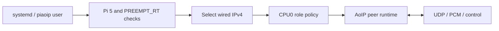

**English** | [Русский](ARCHITECTURE.ru.md)

# Pi 5 architecture

The board wrapper in `apps/main.cpp` validates the platform and selects Ethernet. `src/rpi5.cpp` implements host inspection and thread affinity. The pinned `external/AoIP-lib` dependency implements packet/control/session behavior.

RX and TX: CPU0 / FIFO70; control and reporter: CPU0 / SCHED_OTHER. CPU2 and CPU3 are not used by AoIP. This does not mean those CPUs are globally idle or isolated by the library; other software and the boot configuration remain separate concerns.

The systemd package owns service lifecycle, RT limits and persistent state. The configurator records the PC address and selected Ethernet interface without changing OS addresses. The Pi 5 service waits for an ASIO subscription and stops audio when the session ends. Its LAN service applies the packaged Ethernet tuning policy; see [low-latency operation](LOW-LATENCY.md).

The supplied runtime generates synthetic PCM and checks returned data. It does not open a physical converter or run effects. Network timing results are digital transport results, not ADC-to-DAC latency.

See [installation](BUILD.md), [API](API.md) and [validation](VALIDATION.md).
